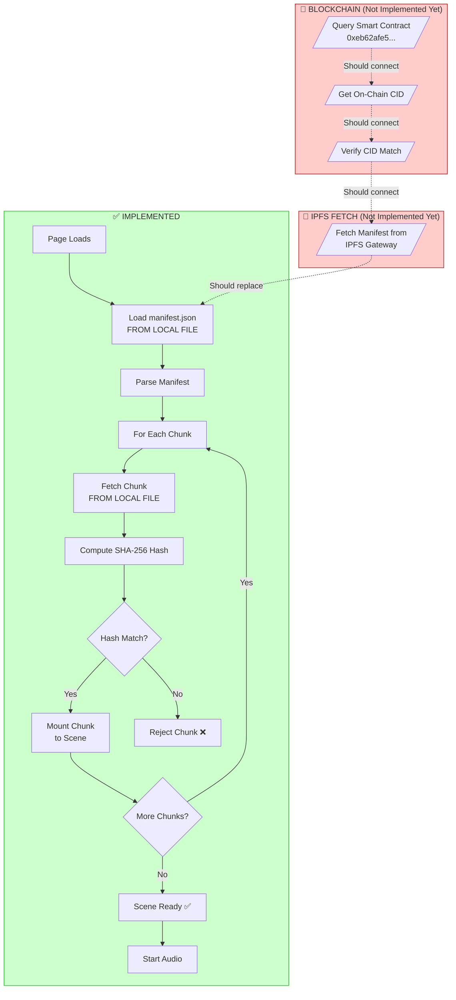

# Verification Flow Diagram

## Current Implementation Status



## What's Working (Green)

| Step | Status | Description |
|------|--------|-------------|
| Load Manifest | ✅ | From local `scenes/manifest.json` |
| Fetch Chunks | ✅ | From local `scenes/sources/*.x3d` |
| SHA-256 Hash | ✅ | Computed for each chunk |
| Hash Verification | ✅ | Compared with manifest |
| Chunk Mounting | ✅ | Via X_ITE Inline nodes |
| LOD Upgrade | ✅ | LOD0 → LOD1 on demand |
| Audio | ✅ | Spatial audio working |

## What's NOT Working (Red)

| Step | Status | Description |
|------|--------|-------------|
| Query Blockchain | ❌ | Should read CID from Sepolia contract |
| IPFS Fetch | ❌ | Should load manifest from IPFS gateway |
| CID Verification | ❌ | Should verify IPFS CID matches on-chain |

## Full Trust Chain (Goal)

```
┌─────────────────┐
│   BLOCKCHAIN    │  Immutable source of truth
│  (Sepolia)      │  Contract: 0xeb62afe5...
└────────┬────────┘
         │ stores
         ▼
┌─────────────────┐
│   IPFS CID      │  Content-addressed identifier
│  bafybei...     │  
└────────┬────────┘
         │ points to
         ▼
┌─────────────────┐
│   MANIFEST      │  Contains SHA-256 hashes
│  manifest.json  │  for all chunks
└────────┬────────┘
         │ verifies
         ▼
┌─────────────────┐
│   CHUNKS        │  X3D scene fragments
│  source-*.x3d   │  Verified before mount
└─────────────────┘
```

## To Complete Blockchain Integration

Need to add:
1. **ethers.js** - To query Sepolia contract
2. **IPFS Gateway fetch** - To load manifest from Pinata
3. **CID comparison** - Verify fetched manifest matches on-chain CID

Estimated: ~30-50 lines of JavaScript
